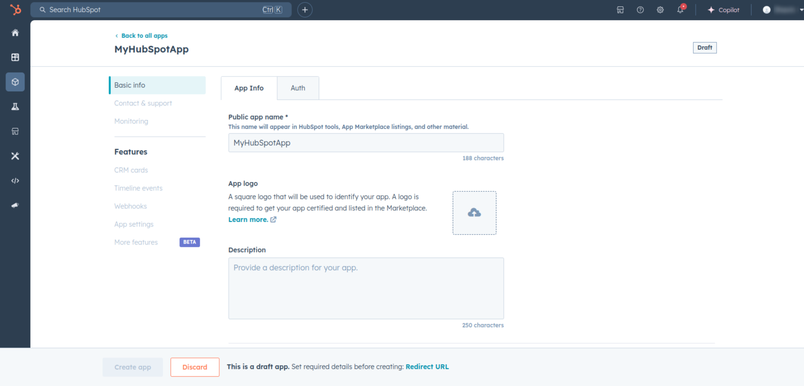
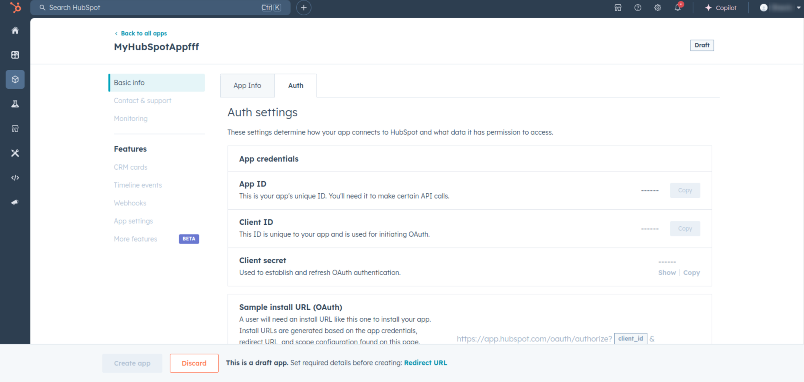
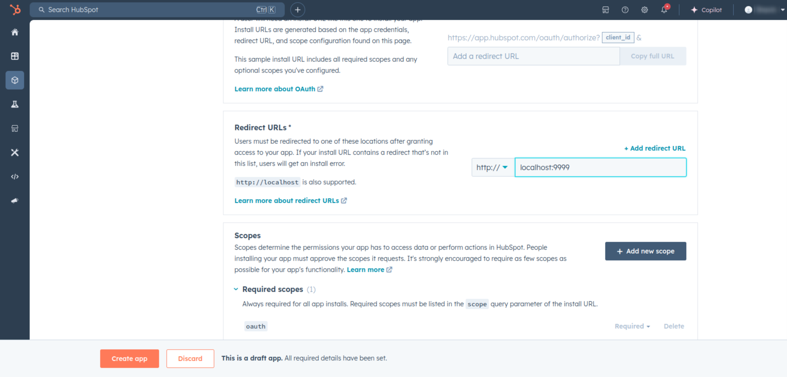
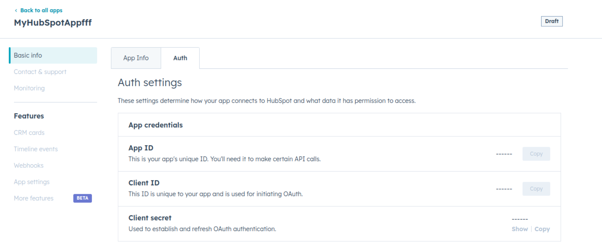
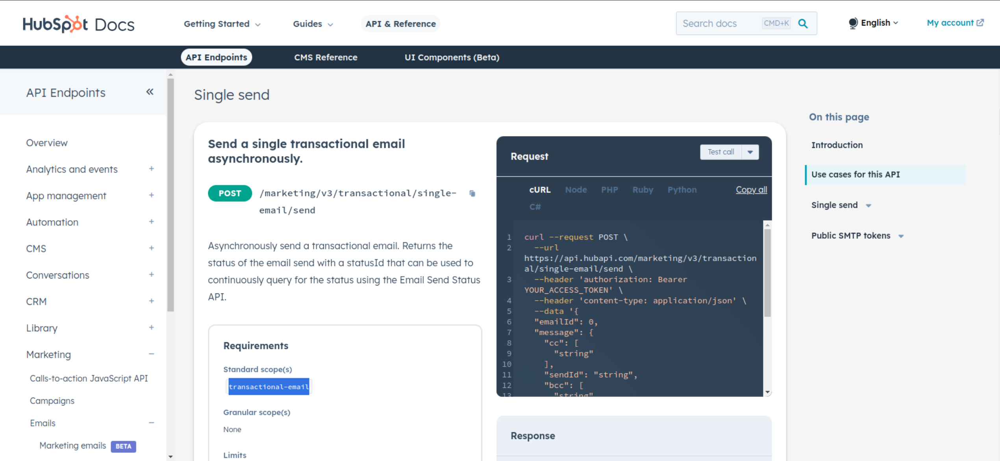

# Ballerina HubSpot Marketing Transactional Connector 

[](https://github.com/ballerina-platform/module-ballerinax-hubspot.marketing.transactional/actions/workflows/ci.yml)
[](https://github.com/ballerina-platform/module-ballerinax-hubspot.marketing.transactional/actions/workflows/trivy-scan.yml)
[](https://github.com/ballerina-platform/module-ballerinax-hubspot.marketing.transactional/actions/workflows/build-with-bal-test-graalvm.yml)
[](https://github.com/ballerina-platform/module-ballerinax-hubspot.marketing.transactional/commits/master)
[](https://github.com/ballerina-platform/ballerina-library/labels/module%hubspot.marketing.transactional)

## Overview

"[HubSpot](https://www.hubspot.com/) is an AI-powered customer relationship management (CRM) platform. 

The ``ballerinax/hubspot.marketing.`transactional`` offers APIs to connect and interact with the [Hubspot Marketing Transactional Emails API](https://developers.hubspot.com/docs/reference/api/marketing/emails/transactional-emails) endpoints, specifically based on the [HubSpot REST API](https://developers.hubspot.com/docs/reference/api/overview)"

## Setup guide

To use the HubSpot Marketing Transactional Emails connector, you must have access to the HubSpot API through a HubSpot developer account and a HubSpot App under it. Therefore you need to register for a developer account at HubSpot if you don't have one already.

### Step 1: Create a HubSpot Developer Project

1. Open the [HubSpot Developer Portal](https://app.hubspot.com/login/?loginRedirectUrl=https%3A%2F%2Fapp.hubspot.com%2Fsignup-hubspot%2Fdevelopers%3F_ga%3D2.269102326.624948025.1734413225-1764281074.1734413225%26step%3Dlanding_page)

2. Click on the 'App' tab and select an existing project or create a new project for which you want API keys and Authentication Access. 


In order to create a new poject, you must provide a public app name and a redirect url/s. Optionally you can add a app logo and a description for the app.



To add redirect url/s for the app, click the 'Auth' tab on top of the page, and navigate to 'Redirect URLs' section.





### Setp 2. Obtain Client ID and Client Secret.

1. After completing the project setup, you will be provided with your client id and client secret.  Make sure to save the provided client id and client secret.



#### 2. Setup OAuth 2.0 Flow

Before proceeding with Quickstart, ensure you have obtained the Access Token and refresh Token using the following steps:

1. Add necessary scopes for your app based on API your using. Go to the relevate [API reference](https://developers.hubspot.com/beta-docs/reference/api),  select the API  you have  and go through the operation.

You will see the scope has defined below way



2. Obtained the authorization URL (Install URL) from the Auth Section under 'Sample install URL (OAuth)' section.  It will be in this format:

```
https://app.hubspot.com/oauth/authorize?client_id=<client_id>&redirect_uri=<redirect_url>&scope=<scopes>
```
3. Copy and paste the generated URL into your browser. This will redirect you to the HubSpot authorization page.


4. Once you authorize, you will be redirected to your specified redirect URI with an authorization code in the URL.

**Note**: Store the authorization code and use it promptly as it expires quickly.

5. Use the obtained authorization code to run the following curl command, replacing <your_client_id>, <your_redirect_url>, and <your_authorization_code> with your specific values:

 - Linux/MacOS:
```bash
curl --request POST \
  --url https://api.hubapi.com/oauth/v1/token \
  --header 'content-type: application/x-www-form-urlencoded' \
  --data 'grant_type=authorization_code&code=<your_authorization_code>&redirect_uri=<your_redirect_url>&client_id=<your_client_id>&client_secret=<your_client_secret>'
```

 - Windows:
 ```bash
 curl --request POST \
  --url https://api.hubapi.com/oauth/v1/token ^
  --header 'content-type: application/x-www-form-urlencoded' ^
  --data 'grant_type=authorization_code&code=<your_authorization_code>&redirect_uri=<your_redirect_url>&client_id=<your_client_id>&client_secret=<your_client_secret>'
 ```

 This command will return the access token and refresh token necessary for API calls.

 ```json
{
  "token_type": "bearer",
  "refresh_token": "xxxxxxxxxxxxxxxxxxxxxxxxxxxxxxx",
  "access_token": "xxxxxxxxxxxxxxxxxxxxxxxxxxxxxxxxxxxxxxxxxxx",
  "expires_in": 1800
}
 ```

 6. Store the access token securely for use in your application.


## Quickstart


To use the `HubSpot Transactional emails` connector in your Ballerina application, update the `.bal` file as follows:

### Step 1: Import the module

Import the ``hubspot.marketing.`transactional`` module and `oauth2` module.

```ballerina
import ballerinax/hubspot.marketing.`transactional as hsmtransactional;
import ballerina/oauth2;
```

### Step 2: Instantiate a new connector

1. Create a `Config.toml` file and, configure the obtained credentials obtained in the above steps as follows:

   ```toml
    clientId = <Client Id>
    clientSecret = <Client Secret>
    refreshToken = <Refresh Token>
   ```

2. Instantiate a `OAuth2RefreshTokenGrantConfig` with the obtained credentials and initialize the connector with it.

    ```ballerina
   configurable string clientId = ?;
   configurable string clientSecret = ?;
   configurable string refreshToken = ?;
   
   hsmtransactional:OAuth2RefreshTokenGrantConfig auth = {
       clientId,
       clientSecret,
       refreshToken,
       credentialBearer: oauth2:POST_BODY_BEARER
   };
   final hsmtransactional:Client hubSpotTransactional = check new ({ auth });
   ```

### Step 3: Invoke the connector operation

Now, utilize the available connector operations. A sample usecase is shown below.

#### Create a SMTP API Token

```ballerina
SmtpApiTokenRequestEgg payload = {
    createContact: true,
    campaignName: "Campaign1"
};
SmtpApiTokenView response = check hubSpotTransactional->/smtp\-tokens.post(payload);
```
## Examples

The `Ballerina HubSpot Marketing Transactional Connector` connector provides practical examples illustrating usage in various scenarios. Explore these [examples](https://github.com/module-ballerinax-hubspot.marketing.transactional/tree/main/examples/), covering the following use cases:

1. [Manage Tokens](https://github.com/module-ballerinax-hubspot.marketing.transactional/tree/main/examples/manage-tokens) - see how the Hubspot API can be used to create SMTP API token and query it.

## Build from the source

### Setting up the prerequisites

1. Download and install Java SE Development Kit (JDK) version 21. You can download it from either of the following sources:

    * [Oracle JDK](https://www.oracle.com/java/technologies/downloads/)
    * [OpenJDK](https://adoptium.net/)

   > **Note:** After installation, remember to set the `JAVA_HOME` environment variable to the directory where JDK was installed.

2. Download and install [Ballerina Swan Lake](https://ballerina.io/).

3. Download and install [Docker](https://www.docker.com/get-started).

   > **Note**: Ensure that the Docker daemon is running before executing any tests.

4. Export Github Personal access token with read package permissions as follows,

    ```bash
    export packageUser=<Username>
    export packagePAT=<Personal access token>
    ```

### Build options

Execute the commands below to build from the source.

1. To build the package:

   ```bash
   ./gradlew clean build
   ```

2. To run the tests:

   ```bash
   ./gradlew clean test
   ```

3. To build the without the tests:

   ```bash
   ./gradlew clean build -x test
   ```

4. To run tests against different environments:

   ```bash
   ./gradlew clean test -Pgroups=<Comma separated groups/test cases>
   ```

5. To debug the package with a remote debugger:

   ```bash
   ./gradlew clean build -Pdebug=<port>
   ```

6. To debug with the Ballerina language:

   ```bash
   ./gradlew clean build -PbalJavaDebug=<port>
   ```

7. Publish the generated artifacts to the local Ballerina Central repository:

    ```bash
    ./gradlew clean build -PpublishToLocalCentral=true
    ```

8. Publish the generated artifacts to the Ballerina Central repository:

   ```bash
   ./gradlew clean build -PpublishToCentral=true
   ```

## Contribute to Ballerina

As an open-source project, Ballerina welcomes contributions from the community.

For more information, go to the [contribution guidelines](https://github.com/ballerina-platform/ballerina-lang/blob/master/CONTRIBUTING.md).

## Code of conduct

All the contributors are encouraged to read the [Ballerina Code of Conduct](https://ballerina.io/code-of-conduct).

## Useful links

* For more information go to the [`hubspot.marketing.transactional` package](https://central.ballerina.io/ballerinax/hubspot.marketing.transactional/latest).
* For example demonstrations of the usage, go to [Ballerina By Examples](https://ballerina.io/learn/by-example/).
* Chat live with us via our [Discord server](https://discord.gg/ballerinalang).
* Post all technical questions on Stack Overflow with the [#ballerina](https://stackoverflow.com/questions/tagged/ballerina) tag.
